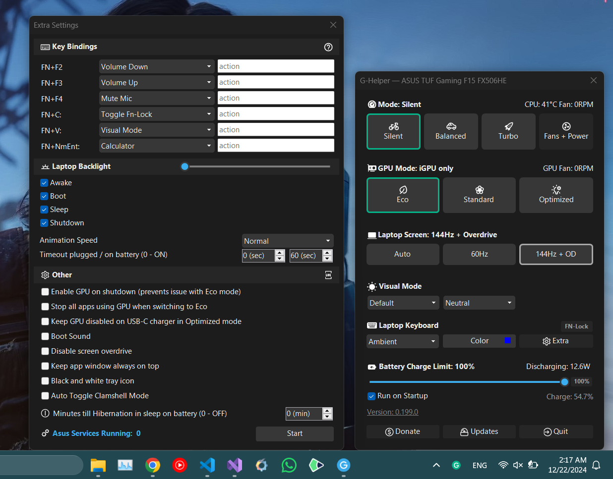

# Essentials-4-Everyone
A repository that I will constantly be updating, containing essential tools with simple guides for installation/usage, even a layman could follow them!

Whether you work in development or are simply looking for new, useful everyday tools, here is a list of some you should consider.

# 📖 Index
<ul>
<li><a href="#best-websites-a-programmer-should-visit">Best websites a programmer should visit</a></li>
<li><a href="#g-helper">G-Helper</a></li>
</ul>

# 🌐 [Best websites a programmer should visit](https://github.com/sdmg15/Best-websites-a-programmer-should-visit)
A repository that is constantly updated, containing handy links related to lots of topics for programmers. Worth a visit whether you're a newbie or a seasoned veteran.

# 💡 [G-Helper](https://github.com/seerge/g-helper)
Lightweight Armoury Crate alternative for Asus laptops, containing almost the same functionality while using much less performance than Armoury Crate.
Works with all popular models, such as ROG Zephyrus G14, G15, G16, M16, Flow X13, Flow X16, Flow Z13, DUO, TUF Series, Strix or Scar Series, ProArt, Vivobook, Zenbook, ROG Ally or Ally X and many more.

## Installation
Download the latest version [here](https://github.com/seerge/g-helper/releases/latest/download/GHelper.zip) and unzip the folder. Then you can run GHelper.exe.

<ul>
  <li>If you get a warning from Windows on launch (Windows Protected your PC). Click More Info -> Run anyway</li>
  <li>If you get a dialog to Search for the app in the Store, it's a bug of Windows Defender. Right-click on GHelper.exe -> select Properties -> select Unblock checkbox</li>
</ul>

For more information regarding installation and requirements, refer to their [requirements page](https://github.com/seerge/g-helper/wiki/Requirements).
For frequently asked questions, refer to their [FAQ page](https://github.com/seerge/g-helper/wiki/FAQ).

  <b><a href="#index">↥ Back To Top</a></b>

